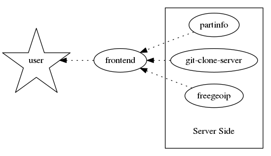
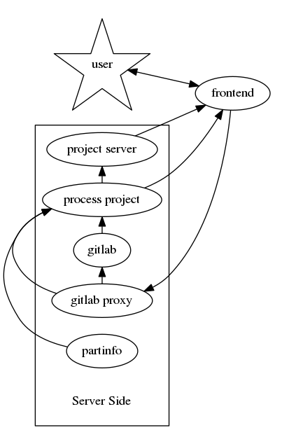

# https://kitspace.org

[![build status][travis-status]](https://travis-ci.org/monostable/kitspace)

[](https://video.fosdem.org/2017/AW1.120/kitnic_it.vp8.webm)

Kit Space (formerly Kitnic) is a registry of open source hardware electronics
projects that are ready to order and build. The most important elements of a
Kitnic project page are:

- A prominent link to download the Gerber files and a preview rendering of the board
- The ability to quickly add the required components to a retailer shopping
  cart (using clever magic in the form of our [browser extension][1clickbom])


Help us build a open hardware repository of useful electronics projects!

## Get in touch

 - [Join Riot.im chat][riot.im] or IRC freenode#kitnic
 - [Post on our Google Groups mailing list](https://groups.google.com/forum/#!forum/kitnic-discuss)

## Submitting your project

Check out [kitspace.org/submit](https://kitspace.org/submit) which will guide you through the process.

### Kitnic.yaml format

Currently the `kitnic.yaml` makes use of the following fields:

```yaml
summary: A description for your project
site: A site you would like to link to (include http:// or https://)
color: The solder resist color of the preview rendering. Can be one of:
       - green
       - red
       - blue
       - black
       - white
       - orange
       - purple
       - yellow
bom: A path to your 1-click-bom in case it isn't `1-click-bom.tsv`.
gerbers: A path to your folder of gerbers in case it isn't `gerbers/`.

```
Paths should be in UNIX style (i.e. use `/` not `\`) and relative to the root
of your repository. The YAML format is pretty straight forward but if you need
to know more check the example below and [the YAML website][6]. Use [this YAML
validator][yamllint] to be extra sure that your `kitnic.yaml` is valid.

### Some examples
Check out the repo links of the projects listed on
[kitspace.org](https://kitspace.org) already. The minimum required file tree is
something like :

```
.
├── 1-click-bom.tsv
└── gerbers
    ├── example.cmp
    ├── example.drd
    ├── example.dri
    ├── example.gko
    ├── example.gpi
    ├── example.gto
    ├── example.plc
    ├── example.sol
    ├── example.stc
    └── example.sts
```

A more advanced example could be something like:

```
.
├── kitnic.yaml
└── manufacture
    ├── advanced-example-BOM.tsv
    └── gerbers-and-drills
        ├── advanced-example-B_Adhes.gba
        ├── advanced-example-B_CrtYd.gbr
        ├── advanced-example-B_Cu.gbl
        ├── advanced-example-B_Fab.gbr
        ├── advanced-example-B_Mask.gbs
        ├── advanced-example-B_Paste.gbp
        ├── advanced-example-B_SilkS.gbo
        ├── advanced-example.drl
        ├── advanced-example-Edge_Cuts.gbr
        ├── advanced-example-F_Adhes.gta
        ├── advanced-example-F_CrtYd.gbr
        ├── advanced-example-F_Cu.gtl
        ├── advanced-example-F_Fab.gbr
        ├── advanced-example-F_Mask.gts
        ├── advanced-example-F_Paste.gtp
        └── advanced-example-F_SilkS.gto
```

with `kitnic.yaml` containing:

```yaml
summary: A more advanced example
site: https://example.com
color: red
bom: manufacture/advanced-example-BOM.tsv
gerbers: manufacture/gerbers-and-drills
```


## Development

### Architecture

#### Current
This repository is the Kitnic front-end. The contents including all project
data are currently pre-compiled into a static site.  The main part of the site
that requires server side components is the submission preview (`/submit`). Pages also use freegeoip lookup to decide what sites to link to for people that do not have the 1-click BOM browser extension. This roughly illustrates the main data flow when someone is browsing the site.



We have two services running for the submission preview.

- [git-clone-server](https://github.com/kasbah/git-clone-server) for serving up files from git repositories.
- [partinfo](https://github.com/monostable/kitnic-partinfo) for getting part information for the BOM.

And one for the geo ip lookup on pages.

- [freegeoip](https://github.com/fiorix/freegeoip)

#### Planned

We are using [GitLab](https://gitlab.com/gitlab-org/gitlab-ce) as an authentication and Git hosting service. We modify and proxy it to get the functionality we need.
The graphs get too complicated if we try to add all the possible data-flows but here is the rough data-flow for submission of a project.



Services used are:

- [nginx-config](https://github.com/monostable/kitnic-nginx-config) to configure Nginx to serve the frontend and all services.
- [partinfo](https://github.com/monostable/kitnic-partinfo) for getting part information for BOMs.
- [gitlab-config](http://github.com/monostable/kitnic-gitlab-config) configuring GitLab to be used for authentication and Git hosting.
- [gitlab-proxy](https://github.com/monostable/kitnic-gitlab-proxy) for requests that need to access GitLab API but need any kind of added functionality like unauthenticated access or modifying projects (which needs additional hooks to trigger processing).

### Roadmap

- [ ] GitLab and Accounts
   - [x] Modify GitLab and integrate with login in Kitnic frontend
   - [x] Build frontend for basic account settings
   - [ ] Make GitLab source of user projects
- [ ] Upload submissions and editing
   - [ ] Allow for file upload to GitLab
   - [ ] Gerber plotter processing for KiCAD and Eagle
   - [ ] BOM extraction processing
   - [ ] BOM Builder
       - [ ] Get retailer info out of [partinfo](https://github.com/monostable/kitnic-partinfo)

### Requirements

- [Nodejs](https://nodejs.org) >= 6
- [fswatch](http://emcrisostomo.github.io/fswatch/) on OSX/Windows or inotify-tools on Linux
- [Ninja Build](https://github.com/ninja-build/ninja/releases) >= 1.5.1
- The rest of the dependencies can be retrieved via `npm install`

### Running a local dev server

- Get requirements above and make sure executables are on your path
- `npm install` (or `yarn install`)
- `npm start` (or `yarn start`)
- Point your browser at `http://127.0.0.1:8080`. The script should watch for
file-saves and re-build when you change a source file.


[viewer]: http://viewer.tracespace.io
[1clickbom]: https://1clickBOM.com
[yamllint]: http://www.yamllint.com
[1clickbom#making]: https://1clickbom.com/#making-a-1-click-bom
[travis-status]: https://travis-ci.org/monostable/kitspace.svg?branch=master
[riot.im]: https://riot.im/app/#/room/#kitnic:matrix.org

[4]: https://help.github.com/articles/create-a-repo/
[5]: https://help.github.com/articles/adding-a-file-to-a-repository/
[6]: http://www.yaml.org/start.html
[8]: https://img.shields.io/badge/mailing--list-kitnic--discuss-green.svg
